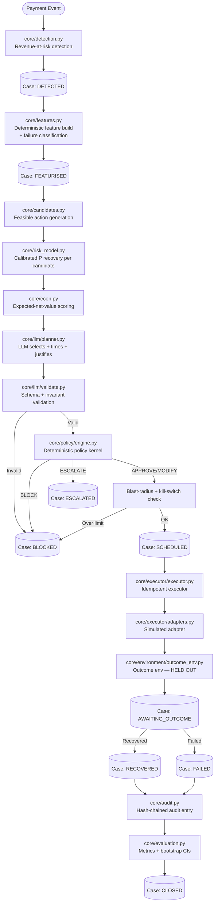
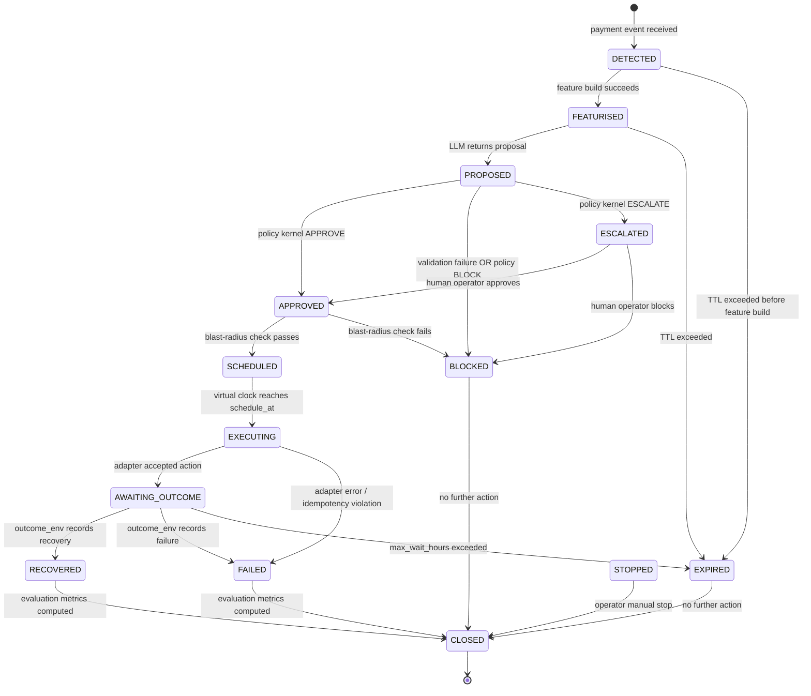

# ARCHITECTURE.md — RevivePay AI Architecture of Record

**Last updated:** Phase 2 — Models, repositories, schemas, architecture tests  
**Status:** Domain ORM, repository layer, and Pydantic schemas are implemented.
Decision-pipeline / held-out environment modules are not yet implemented.

---

## System Purpose

RevivePay AI is an autonomous revenue-recovery control plane for a payments company.
When a payment fails, a checkout is abandoned, or a subscription mandate debit fails,
revenue is at risk. The system:

1. **Detects** the at-risk revenue event.
2. **Builds** a deterministic feature vector from observable signals.
3. **Estimates** a calibrated probability of recovery for each feasible intervention.
4. **Scores** each intervention by expected NET value (recovered value minus costs).
5. **Plans** using an LLM that selects, times and justifies one intervention from the
   feasible set, citing specific features.
6. **Constrains** that LLM proposal through schema validation, invariant checks, and a
   deterministic policy kernel that has final authority.
7. **Executes** the approved action idempotently against a simulated payment environment.
8. **Measures** every outcome and compares against five baseline strategies on identical
   random seeds.

---

## Three Product Pillars

### 1 — DECIDE
Calibrated probability model + cost-aware expected-value optimiser + LLM planner for
handling messy context, timing and personalised messaging. The LLM does not compute
numbers; the statistical model does.

### 2 — CONSTRAIN
An LLM can never execute a financial action. Its output is a proposal that must pass:
schema validation → invariant checks → deterministic policy kernel → budget/blast-radius
limits → idempotent executor. The kernel fails closed on any error.

### 3 — PROVE
Results are only credible if the outcome environment is held out from the decision logic.
Ground-truth parameters are pre-registered and hashed; no decision-making module may read
them. All evaluations are counterfactual comparisons against baselines on identical seeds
with bootstrap confidence intervals.

---

## Technology Stack

| Layer | Technology | Rationale |
|---|---|---|
| Backend language | Python 3.11+ | Ecosystem for ML, async IO, type safety |
| API framework | FastAPI | Async, Pydantic-native, OpenAPI auto-docs |
| ORM | SQLAlchemy 2.0 (async) | Database-agnostic; portable to Postgres |
| Schema validation | Pydantic v2 | Performance, strict types, JSON-schema generation |
| Config | pydantic-settings | Env-var + `.env` loading with validation |
| Database | SQLite (dev/prototype) | Zero-setup; one-line swap to Postgres via `DATABASE_URL` |
| ML | scikit-learn + numpy + pandas | Calibrated classifiers; no deep-learning dependency |
| LLM abstraction | Provider-agnostic adapter | Mock (default), Gemini, OpenAI, Anthropic |
| Test runner | pytest | Industry standard; async support via `pytest-asyncio` |
| Lint & format | ruff | Fast; replaces flake8 + isort + black |
| Type checker | mypy (strict) | Catches contract violations at CI time |
| Frontend | Next.js 15 App Router | SSR, React Server Components, file-based routing |
| Frontend language | TypeScript (strict) | Type safety across the stack |
| UI primitives | shadcn/ui + Tailwind CSS | Accessible, composable, zero-runtime |
| Charts | Recharts | React-native charting |
| Data fetching | TanStack Query v5 | Cache, loading/error states, background refresh |
| API validation | Zod | Runtime validation of API responses in the browser |
| Orchestration | Makefile + docker-compose | One-command dev and demo |

### Database Trade-Off (see ADR-0001)

SQLite provides zero-setup reproducibility for reviewers. All database access is through
SQLAlchemy ORM — no raw SQL, no SQLite-specific pragmas in application code. Migrating to
PostgreSQL requires changing `DATABASE_URL` only; no application code changes.

Limitations accepted for the prototype: no concurrent writes, limited SQL feature set,
foreign key enforcement requires per-connection PRAGMA (handled by SQLAlchemy's event hook).

### LLM Provider Abstraction

The `core/llm/provider.py` module defines an abstract `LLMProvider` interface. Four
implementations exist:

| Provider | Requires Key | Use Case |
|---|---|---|
| `MockProvider` | No | Default; deterministic; full demo with no external deps |
| `GeminiProvider` | `GEMINI_API_KEY` | Google Gemini family |
| `OpenAIProvider` | `OPENAI_API_KEY` | GPT-4o family |
| `AnthropicProvider` | `ANTHROPIC_API_KEY` | Claude family |

The active provider is selected via `LLM_PROVIDER` environment variable. The system runs
fully end-to-end with `LLM_PROVIDER=mock` and no API keys.

---

## Decision Pipeline

Every revenue-at-risk event flows through the following pipeline. Each stage is a separate
Python module with a defined input/output contract. **No stage may skip or reorder.**

```
┌─────────────────────────────────────────────────────────────────────┐
│                        DECISION PIPELINE                            │
│                                                                     │
│  [Event]                                                            │
│    │                                                                │
│    ▼                                                                │
│  core/detection.py          Revenue-at-risk detection               │
│    │  Classifies: payment_failure | abandoned_checkout |            │
│    │              mandate_debit_failure                             │
│    ▼                                                                │
│  Case created in DB         CaseState: DETECTED                     │
│    │                                                                │
│    ▼                                                                │
│  core/features.py           Deterministic feature builder           │
│    │  Pure function: event + history → FeatureVector                │
│    │  No randomness, no external calls                              │
│    ▼                                                                │
│  CaseState: FEATURISED                                              │
│    │                                                                │
│    ▼                                                                │
│  core/features.py           Deterministic failure classification    │
│    │  Categorise failure reason from feature vector                 │
│    ▼                                                                │
│  core/candidates.py         Feasible candidate action generation    │
│    │  Enumerate valid actions given failure type + policy rules     │
│    ▼                                                                │
│  core/risk_model.py         Calibrated P(recovery | action, X)      │
│    │  scikit-learn CalibratedClassifierCV; one estimate per         │
│    │  candidate                                                     │
│    ▼                                                                │
│  core/econ.py               Expected-net-value scoring              │
│    │  ENRV = P(recovery)×amount − costs − P(churn)×LTV             │
│    ▼                                                                │
│  core/llm/planner.py        LLM planner                            │
│    │  Input: feature vector + scored candidates + policy prose      │
│    │  Output: Proposal JSON (action_id, schedule_offset_hours,      │
│    │          justification, feature_citations)                     │
│    │  The LLM does NOT compute numbers or call APIs                 │
│    ▼                                                                │
│  core/llm/validate.py       Schema + invariant validation           │
│    │  Pydantic parsing → enum/range checks → citation check         │
│    │  Failure → BLOCKED immediately                                 │
│    ▼                                                                │
│  core/policy/engine.py      Deterministic policy kernel             │
│    │  Ordered rules from policy.yaml; fails closed                  │
│    │  Verdict: APPROVE | MODIFY | BLOCK | ESCALATE                  │
│    ▼                                                                │
│  CaseState: APPROVED | BLOCKED | ESCALATED                          │
│    │                                                                │
│    ▼  (if APPROVED)                                                 │
│  Blast-radius + kill-switch check                                   │
│    │  Budget cap, rate limit, operator kill-switch                  │
│    ▼                                                                │
│  CaseState: SCHEDULED → EXECUTING                                   │
│    │                                                                │
│    ▼                                                                │
│  core/executor/executor.py  Idempotent executor                     │
│    │  Checks idempotency key uniqueness, then calls adapter         │
│    ▼                                                                │
│  core/executor/adapters.py  Adapter (simulated / test-mode)        │
│    │  SimulatedAdapter (default, always used in prototype)          │
│    ▼                                                                │
│  core/environment/          Outcome recorded (HELD OUT)             │
│  outcome_env.py             Applies world_config.yaml to determine  │
│    │                        actual outcome; not readable by          │
│    │                        decision modules                        │
│    ▼                                                                │
│  CaseState: AWAITING_OUTCOME → RECOVERED | FAILED                  │
│    │                                                                │
│    ▼                                                                │
│  core/audit.py              Append-only hash-chained audit entry    │
│    │                                                                │
│    ▼                                                                │
│  core/evaluation.py         Metrics recomputed from stored rows     │
│    │  Bootstrap CIs; comparison against all baselines               │
│    ▼                                                                │
│  CaseState: CLOSED                                                  │
└─────────────────────────────────────────────────────────────────────┘
```

As a Mermaid diagram:



---

## Case Lifecycle State Machine



**Legal Transitions Only.** The policy kernel rejects any state transition not listed above.
`STOPPED` is triggered by operator action only (kill-switch or manual API call).
`CaseRepository.transition_state` enforces the same legal graph at the persistence boundary.

---

## Persistence layer (repositories)

SQLAlchemy session/engine setup lives in `backend/app/db.py` (`Base`, engine factory,
`get_session_factory`, FastAPI `get_db`). Domain code talks to the database through
`backend/app/repositories/`:

| Module | Responsibility |
|---|---|
| `base.py` | Generic `BaseRepository[ModelT]` — `add`, `get`, `get_or_raise`, `list`, `delete` |
| `cases.py` | Open-case queries and legal `transition_state` |
| `transactions.py` | Failed-since / by-merchant lookups |
| `decisions.py` | Latest / list decisions for a case |
| `actions.py` | `create_idempotent` (UNIQUE key; no SELECT-then-insert) |
| `outcomes.py` | Record / get-by-action |
| `audit.py` | Gapless seq + hash-chained `append` using `models.audit.compute_audit_hash` |
| `contact_ledger.py` | Contact counts and recording |
| `bandit_stats.py` | Get-or-create cells and posterior updates |

Other tables use `BaseRepository` directly — no one-repo-per-table boilerplate (ADR-0009).

### Dependency direction

Dependencies point **inward** toward the domain models:

```
api / services / core  →  repositories  →  models
                              ↑
                         schemas (DTO)
```

- `app.models.*` must not import `app.repositories`, `app.services`, or `app.api`.
- Held-out environment modules must never be imported by decision/policy/agent/ml code
  (enforced by `tests/test_architecture.py` — ADR-0010).
- Monetary ORM columns must not use `Float` / `Numeric` / `Decimal` inside
  `mapped_column(...)` (same architecture test).

---

## Module Layout

```
revivepay-ai/
├── backend/
│   ├── app/
│   │   ├── main.py               FastAPI application entry point
│   │   ├── config.py             pydantic-settings config object
│   │   ├── db.py                 SQLAlchemy engine + session factory + get_db
│   │   ├── models/               ORM entity definitions (SQLAlchemy)
│   │   ├── schemas/              Pydantic v2 API and LLM contract schemas
│   │   ├── repositories/         Typed persistence adapters (selective concretes)
│   │   ├── api/                  FastAPI route modules and dependencies (later)
│   │   └── core/                 Decision pipeline (later phases)
│   │       ├── detection.py      Revenue-at-risk event detection
│   │       ├── features.py       Deterministic feature builder
│   │       ├── risk_model.py     Calibrated recovery-probability model
│   │       ├── econ.py           Cost model and expected-value scoring
│   │       ├── candidates.py     Feasible intervention generation
│   │       ├── orchestrator.py   The agent loop
│   │       ├── baselines.py      do-nothing, fixed-ladder, rules-only,
│   │       │                     econ-argmax, unconstrained-LLM
│   │       ├── evaluation.py     Metrics, bootstrap CIs, report generation
│   │       ├── learning.py       Thompson sampling and offline refit
│   │       ├── audit.py          Append-only hash-chained audit log
│   │       ├── llm/
│   │       │   ├── provider.py   Abstract LLMProvider + factory
│   │       │   ├── prompts.py    Versioned prompt templates
│   │       │   ├── planner.py    LLM planning logic
│   │       │   └── validate.py   Schema + invariant + citation validation
│   │       ├── policy/
│   │       │   ├── engine.py     Deterministic policy kernel
│   │       │   ├── rules.py      Rule evaluation helpers
│   │       │   └── policy.yaml   Ordered policy rules (versioned)
│   │       ├── executor/
│   │       │   ├── executor.py   Idempotent action executor
│   │       │   ├── adapters.py   Adapter interface + SimulatedAdapter
│   │       │   └── clock.py      Virtual clock
│   │       └── environment/      ⚠ HELD OUT — never imported by decision modules
│   │           ├── outcome_env.py  Outcome simulator
│   │           └── world_config.yaml  Ground-truth parameters (pre-hashed)
│   ├── data/
│   │   ├── generate_dataset.py   Synthetic dataset generator
│   │   └── seed.py               Database seeder
│   └── tests/                    pytest test suite (incl. test_architecture.py)
├── frontend/
│   └── src/
│       ├── app/                  Next.js 15 App Router pages
│       ├── components/           Shared React components
│       └── lib/                  API client, Zod schemas, utilities
├── data/                         Generated datasets (git-ignored except sample)
├── reports/                      Generated evaluation reports
├── docs/                         Extended documentation
├── .github/workflows/ci.yml      CI pipeline
├── docker-compose.yml
├── Makefile
├── .env.example
├── .gitignore
├── AGENTS.md
├── ARCHITECTURE.md               (this file)
├── DECISIONS.md
├── LICENSE
└── README.md
```

---

## Virtual Clock Design (ADR-0007)

All time-aware code reads from `core/executor/clock.py` — never from `datetime.now()`.

```
VirtualClock
  ├── epoch_real: datetime       Wall-clock time when the simulation started
  ├── epoch_virtual: datetime    Virtual time at simulation start (configurable)
  ├── rate: float                Virtual seconds per real second (default: 60)
  └── now() → datetime           Returns current virtual time
      advance(hours) → None      Teleports virtual time forward (test helper)
```

In demo mode (`SIM_DEFAULT_SEED` set, `rate=60`): a 7-day retry ladder plays out in
7 minutes of real time. In test mode: `advance()` allows instant time travel.

All scheduled actions store a `scheduled_at_virtual` timestamp. The executor's tick loop
calls `clock.now()` and runs any action where `scheduled_at_virtual <= clock.now()`.

---

## Pre-Registration and Hashing for Reproducibility

At the start of every evaluation run:

1. `world_config.yaml` is read, SHA-256 hashed, and the hash is stored in the run manifest.
2. `policy.yaml` is SHA-256 hashed and stored in every policy verdict record.
3. Every prompt template in `core/llm/prompts.py` is hashed and stored with every LLM call.

This means any run can be fully replayed by:
- Checking out the same git commit.
- Using the same `SIM_DEFAULT_SEED`.
- Verifying the hashes in the run manifest match the committed files.

---

## Counterfactual Evaluation Design (ADR-0008)

```
                    ┌─────────────────────────────┐
  Seeded case pool  │  Same cases, same seeds,     │
  (N cases from     │  same environment             │
   SIM_DEFAULT_SEED)│                              │
                    └──────────────┬──────────────┘
                                   │
              ┌────────────────────┼────────────────────┐
              │                    │                    │
              ▼                    ▼                    ▼
        do_nothing           fixed_ladder         rules_only
              │                    │                    │
              ▼                    ▼                    ▼
        econ_argmax      unconstrained_llm        revivepay_ai
              │                    │                    │
              └────────────────────┴────────────────────┘
                                   │
                                   ▼
                     core/evaluation.py
                     ├── ENRV per case per strategy
                     ├── Aggregate ENRV (mean ± bootstrap 95% CI)
                     ├── Recovery rate (mean ± CI)
                     ├── Uplift vs each baseline (Δ ENRV, lower CI > 0 = win)
                     ├── Brier score (calibration quality)
                     └── Policy block rate, escalation rate
```

All six strategies share the same `numpy.random.default_rng(SIM_DEFAULT_SEED)` stream,
advanced in lockstep, so environmental variance across strategies is exactly zero.

---

## Security Architecture

- Secrets: environment variables only. `.env` is git-ignored.
- API authentication: bearer token checked against `API_KEY_OPERATOR` or `API_KEY_VIEWER`
  in every protected endpoint. Keys come from environment variables.
- Personal data: synthetic IDs only. Emails/phones stored as SHA-256 hashes, displayed
  as `e***@***.com` / `+91-XXXXX-XX789`.
- Audit log: append-only, hash-chained. Tampering is detectable.
- Simulated environment label: the UI displays a persistent "SIMULATED DATA" banner
  whenever `RAZORPAY_ADAPTER_ENABLED=false` (the default).

---

## What Remains (post Phase 2)

Implemented through Phase 2: ORM models, Pydantic schemas, repository layer, FastAPI
system endpoints, and executable architecture tests.

Still to build in later phases:
- FastAPI domain routes (`backend/app/api/`)
- All `core/` decision-pipeline modules
- Held-out environment + `world_config.yaml`
- Synthetic data generation
- Frontend product pages
- ML training pipeline
- Evaluation runner
